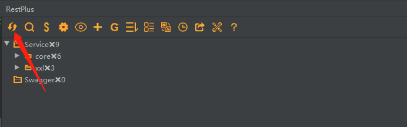
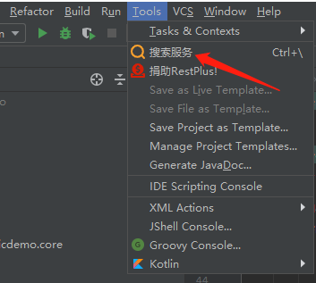
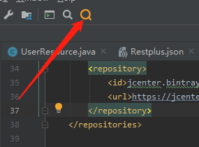
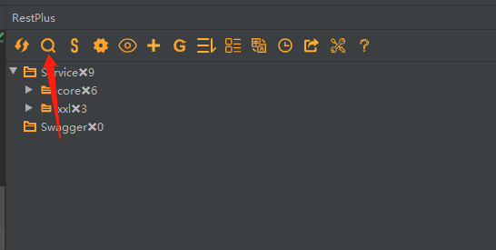
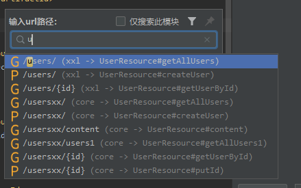
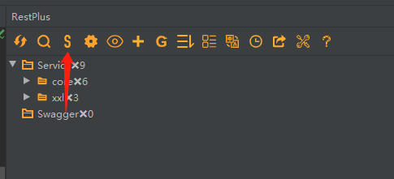
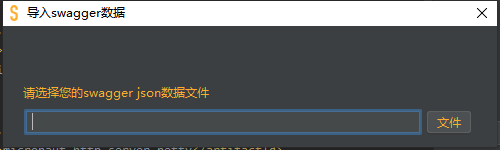
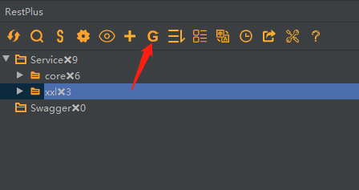
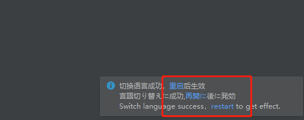

# 1.RestPlus是什么？
一套 RESTful 服务开发辅助工具集(支持最新的idea2020)。
* 根据 URL 直接跳转到对应的方法定义 ( Ctrl \ or Ctrl Alt N );
* 提供了一个 Services tree 的显示窗口;
* 一个简单的 http 请求工具;
* 其他功能: java 类上添加 <em>Convert to JSON</em> 功能，<em>格式化 json 数据</em> ( <em>Windows: F5; Mac: F5</em> )。
* 支持导入swagger数据
* 支持多环境（开发、测试、预发布......）
* 支持对单个url设置不同的环境变量
* 支持手动添加url
* 支持多个用例
* 支持测试用例（参考RestClient测试代码）
* 支持界面多语言（英语、汉语、日语）
* 支持查看请求的历史记录
* 支持接口快速提交到yapi
* 支持 Spring 体系 (Spring MVC / Spring Boot)
* 支持 JAX-RS
* 支持 Micronaut
* 支持 Java 和 Kotlin 语言。


# 2.项目新增接口后，如何刷新接口列表？
如下图所示，点击刷新按钮即可完成接口列表的刷新。


 

# 3.如何查找接口？
可以通过以下三种方法打开接口搜索框，也可以使用快捷键```CTRL + \ (mac command + \)```



 


 

如下，弹出搜索框，可以键入需要搜索的接口，使用键盘上下方向键可选择对应的接口，然后使用回车定位到该接口。

 

# 4.如何导入swagger中的接口到RestPlus中？

 


 

# 5.设置


# 6.接口分组

  


# 2.如何设置RestPlus界面显示语言？

RestPlus 当前支持英语、汉语、日语三种语言， 可以点击插件上方的语言设置图标，选择合适的语言，

如下图所示，选择完毕后idea右下角会弹出提示框，点击其中的链接重启idea即可完成语言设置。


 

 
